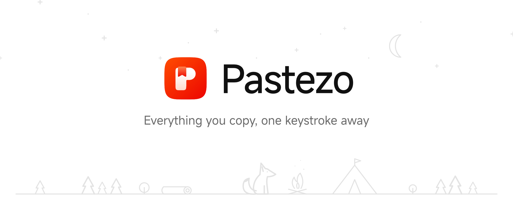
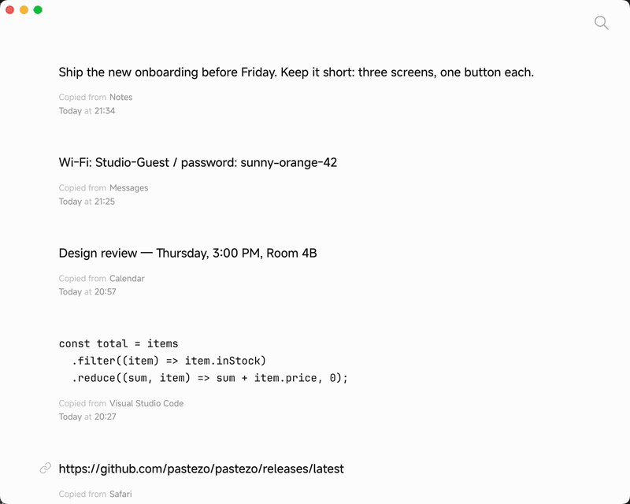

<a href="https://github.com/pastezo/pastezo/releases/latest">
  <picture>
    <source media="(prefers-color-scheme: dark)" srcset=".github/assets/header-dark.png" />
    
  </picture>
</a>

<h4 align="center">
  <a href="https://github.com/pastezo/pastezo/releases/latest">Download</a> |
  <a href="CHANGELOG.md">Changelog</a> |
  <a href="https://github.com/pastezo/pastezo/issues">Report a bug</a>
</h4>

<div align="center">
  <h2>
    A clipboard manager for macOS, Windows and Linux. </br>
    Light, fast and quiet in the background. </br>
  <br />
  </h2>
</div>

<p align="center">
  <a href="https://github.com/pastezo/pastezo/releases/latest">
    </a>
  <a href="https://github.com/pastezo/pastezo/releases">
    </a>
  
  <a href="apps/pastezo/locales">
    </a>
</p>

<div align="center">
  <figure>
    <a href="https://github.com/pastezo/pastezo/releases/latest">
      
    </a>
    <figcaption>
      <p align="center">
        Copy, delete and undo, preview, search with typos and filters, settings.
      </p>
    </figcaption>
  </figure>
</div>

## Features

- 📋&nbsp;Keeps everything you copy: text, links and images.
- 🔍&nbsp;Search that forgives typos, with filters: `app:Safari`, `type:image`, `after:yesterday`.
- ⌨️&nbsp;Works from the keyboard: arrows, preview, copy, delete.
- ↩️&nbsp;Deleted a clip by mistake? ⌘Z brings it back.
- 🧑‍💻&nbsp;Code is recognised and shown in a monospace font.
- 🖱️&nbsp;Drag an image out of the history into any app.
- 🎨&nbsp;Themes, fonts and alternative app icons.
- 📊&nbsp;Statistics: how much you copy per day.
- 💾&nbsp;Import and export of the whole history.
- 🌐&nbsp;54 languages, right-to-left included.
- 🔒&nbsp;Your history stays on your computer.

## Download

Get the latest build on the [releases page](https://github.com/pastezo/pastezo/releases/latest).

| OS | File | Minimum |
|---|---|---|
| macOS (Apple Silicon) | `Pastezo-<version>-macos-arm64.dmg` | macOS 11 |
| macOS (Intel) | `Pastezo-<version>-macos-x64.dmg` | macOS 10.15 |
| Windows | `Pastezo-<version>-windows-x64.zip` / `-arm64.zip` | Windows 10 |
| Linux | `Pastezo-<version>-linux-x64.tar.gz` / `-arm64.tar.gz` | X11 or Wayland |

On Linux, unpack the archive and run `./install.sh` — it installs Pastezo into `~/.local`.

## Shortcuts

| Action | macOS | Windows / Linux |
|---|---|---|
| Search | ⌘F | Ctrl+F |
| Settings | ⌘, | Ctrl+, |
| Copy the selected clip | ⌘C | Ctrl+C |
| Bring back a deleted clip | ⌘Z | Ctrl+Z |
| Select a clip | ↑ ↓ | ↑ ↓ |
| Preview | Return, Space | Return, Space |
| Delete | ⌫ | Delete |

## Build from source

```bash
cargo build -p pastezo-agent
cargo run --release -p pastezo
```

## Contributing

- Found a bug or missing something? [Open an issue](https://github.com/pastezo/pastezo/issues).
- Want to fix a translation? Files are in [`apps/pastezo/locales`](apps/pastezo/locales).

## Credits

Pastezo uses the [MiSans](https://hyperos.mi.com/font/en/) font by Xiaomi and [JetBrains Mono](https://www.jetbrains.com/lp/mono/) (SIL OFL 1.1).
